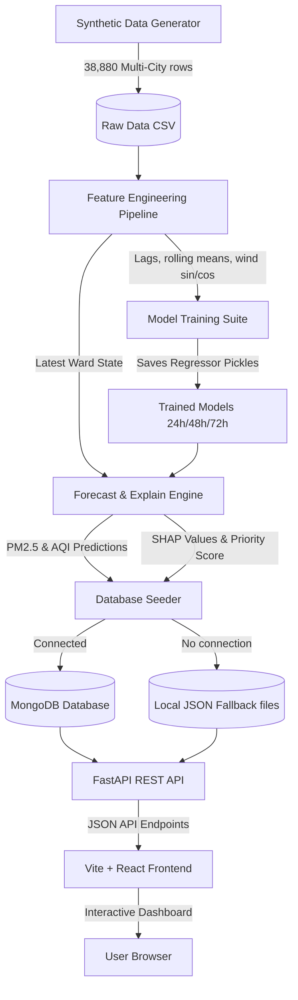

# VaayuLens AI 🌬️
### AI-Powered Multi-City Air Quality Intelligence for Smart City Intervention
**Theme**: Smart Cities / Environmental Intelligence / Geospatial Analytics / Public Health

VaayuLens AI is a hyperlocal, multi-city air quality forecasting, explainability, and citizen advisory platform designed for smart city municipal interventions. It fuses ground station measurements, meteorological dynamics, and population exposures to predict pollution danger spots, explain local triggers, and guide resource allocation.

---

## 🚀 Key Features (Hackathon Ready)

1. **Multi-City Geospatial Monitoring**: Fully maps 18 CPCB-level stations across three major Indian metros representing distinct microclimatic profiles:
   * **Delhi NCT** (Thermal inversions, extreme winter spikes, seasonal crop stubble drift).
   * **Mumbai** (Coastal winds, high humidity, land-sea breeze aerosol dispersion).
   * **Bengaluru** (High altitude cooling, low humidity, commuter traffic corridors).
2. **Hyperlocal 72h Forecasting**: Uses Gradient Boosted Trees (LightGBM/XGBoost with a fallback to Scikit-Learn `HistGradientBoostingRegressor`) to forecast PM2.5 and AQI levels at 24h, 48h, and 72h horizons.
3. **SHAP AI Explainability**: Uses SHAP (SHapley Additive exPlanations) values to explain the specific drivers behind predictions, translating complex numerical matrices into human-readable factors (e.g. wind dispersion, traffic loads, meteorological conditions).
4. **Multilingual Health Advisory**: Translates health advisories dynamically to local languages: **English**, **Hindi (हिंदी)** (Delhi & Mumbai default), and **Kannada (ಕನ್ನಡ)** (Bengaluru default), providing actionable instructions for citizens.
5. **Enforcement Priority Index**: Guides municipal action by calculating a dynamic priority ranking: `Forecasted AQI Severity × Population Exposure (per 100k)`. Wards with high human density (e.g., Sion in Mumbai, Peenya in Bengaluru) are flagged immediately.
6. **Premium Sidebar & Dashboard UI**: Engineered a high-end, responsive layout modeled after modern dashboard systems:
   * **Vertical navigation sidebar** (Home Map and Priority Ranking pages).
   * **Top-split Map view** with floating search/filter panels.
   * **Dark Badge Markers** displaying `Station Name | AQI | PM2.5 | Priority` separated by dividers.
   * **Dynamic Semicircle Gauge Charts** dynamically updating matching colors based on AQI severity.

---

## 📐 Architecture & Data Flow



---

## 🛠️ Tech Stack

- **Backend**: Python 3.11+, FastAPI, Uvicorn, Pandas, NumPy, Scikit-Learn, SHAP, Joblib
- **Containerization**: Docker (Docker-slim, optimized multi-stage build, libomp packages preconfigured)
- **Database**: MongoDB (Motor async driver) with robust local JSON fallback file storage
- **Frontend**: React 18, Vite, Tailwind CSS v3, React Leaflet (OpenStreetMap), Recharts, Axios, React Router Dom

---

## ⚙️ Setup & Running

### 1. Backend Setup
1. Navigate to the backend directory:
   ```bash
   cd backend
   ```
2. Create and activate a virtual environment:
   ```bash
   python3 -m venv venv
   source venv/bin/activate
   ```
3. Install dependencies:
   ```bash
   pip install -r requirements.txt
   ```
4. Run the Database Seeder pipeline (this generates multi-city synthetic historical data, trains models, performs SHAP explanations, and seeds either MongoDB or generates JSON fallback database files):
   ```bash
   python db/seed_db.py
   ```
5. Start the FastAPI API server:
   ```bash
   uvicorn main:app --reload --host 127.0.0.1 --port 8000
   ```
   *The backend API will be available at http://127.0.0.1:8000. You can inspect the interactive OpenAPI docs at http://127.0.0.1:8000/docs.*

### 2. Frontend Setup
1. Navigate to the frontend directory:
   ```bash
   cd frontend
   ```
2. Install npm dependencies:
   ```bash
   npm install
   ```
3. Start the React local development server:
   ```bash
   npm run dev
   ```
   *The frontend client will be available at http://localhost:5173.*

### 3. Docker Deployment (Optional / Production)
To run the backend inside a Docker container:
```bash
cd backend
docker build -t vaayulens-backend .
docker run -p 8000:8000 vaayulens-backend
```

---

## 🧪 Automated Testing
Run the API integration test suite to verify endpoints and city-filters:
```bash
cd backend
./venv/bin/python tests/test_api.py
```

---

## 📊 Model Performance
The Gradient Boosted Regressors achieve significant error reduction compared to a naive persistence baseline (predicting $t+H$ using the value at $t$):
- **24h Forecast**: **~31.1%** improvement (RMSE: 47.27 vs 68.58 baseline)
- **48h Forecast**: **~29.0%** improvement (RMSE: 57.19 vs 80.53 baseline)
- **72h Forecast**: **~23.3%** improvement (RMSE: 69.31 vs 90.35 baseline)

---

## 📢 Data Mode Disclosure
*This prototype runs in **Synthetic Mode** by default. It generates 90 days of hourly air quality history reflecting Delhi, Mumbai, and Bengaluru's true microclimatic conditions (e.g. coastal breezes, thermal inversion, and traffic patterns). The architecture is ready to accept live feeds from CPCB (via WAQI) and OpenWeatherMap APIs by configuring `DATA_MODE=live` and environment API tokens.*
