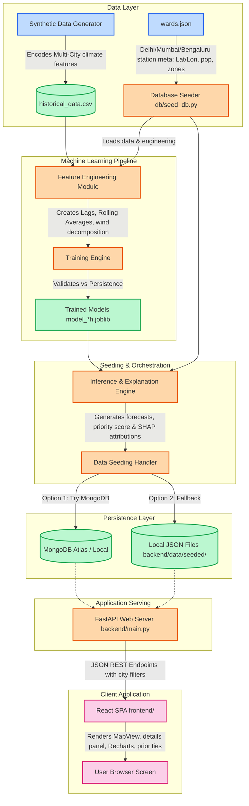

# Architecture & Data Flow Diagram

This document illustrates the data collection, feature engineering, model training, persistence, API serving, and visual dashboard pipelines.

### Explaining the Data Flow

1. **Generation & Engineering**:
   - `generate_synthetic_data.py` executes first to construct 90 days of hourly parameters tailored to coastal Mumbai land-sea breeze, high-altitude Bengaluru moderate dynamics, and Delhi's winter thermal inversion.
   - `features.py` builds Lag features (`t-1` to `t-168`), sliding-window averages, and time-of-day sin/cos encodings.

2. **Model Training**:
   - `train_model.py` splits the dataset sequentially (first 76 days train, last 14 days test).
   - Three independent regressors are trained (forecasting $t+24$, $t+48$, and $t+72$ hours ahead) per city.
   - If LightGBM or XGBoost are missing openMP/libomp runtimes on macOS, it falls back gracefully to `HistGradientBoostingRegressor` from `scikit-learn`.

3. **SHAP & Attribution**:
   - `explain.py` uses SHAP's TreeExplainer to attribute forecasts to underlying drivers.
   - Attributions are calculated for the latest record per ward and stored as easily digestible factors.

4. **Web Delivery**:
   - `mongo_client.py` uses a connection tester to check if a database is active.
   - If MongoDB fails, it activates the `MockDatabase` layer, which reads and serves from cached files in `backend/data/seeded/`.
